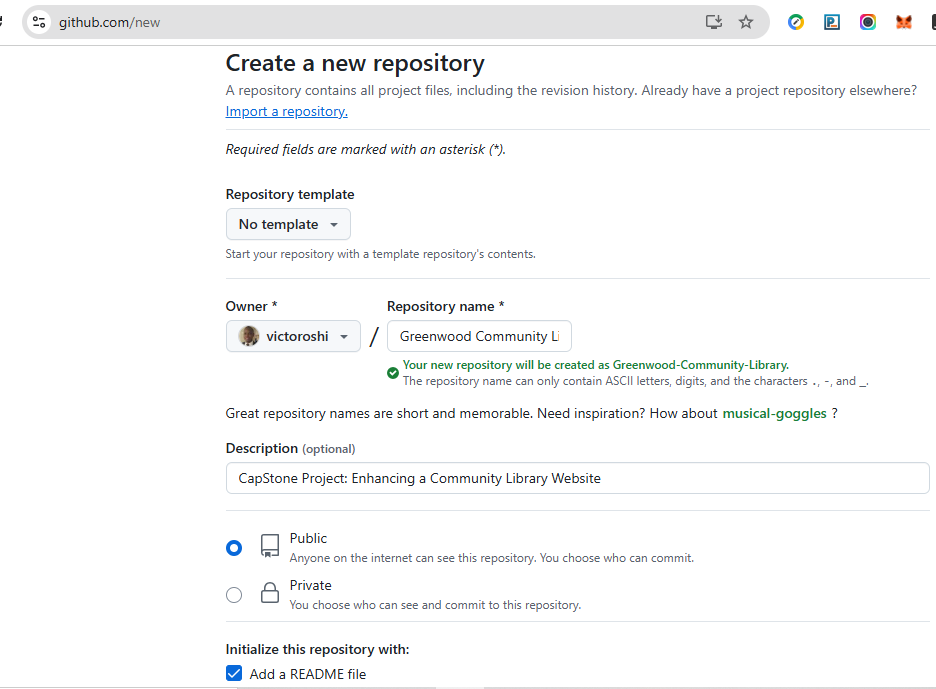
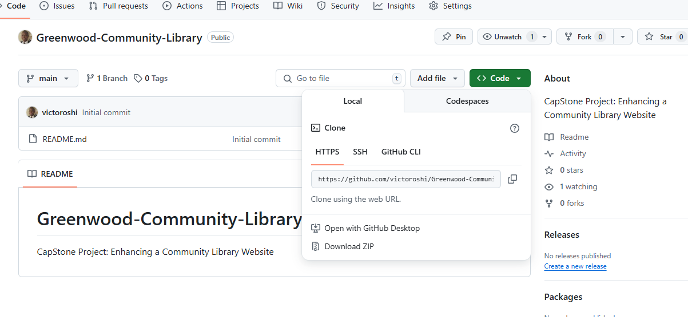
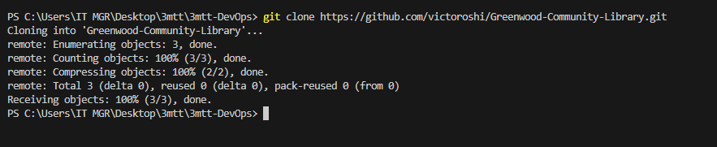

# Greenwood-Community-Library
CapStone Project: Enhancing a Community Library Website

## Background Scenario
You're part of a development team tasked with enhancing the website for the ***Greenwood Community Library.***
The website aims to be more engaging and informative for its visitors. It currently includes basic sections: Home, About Us, Events, and Contact Us . Your team decides to add a ***Book Reviews***  section and update the ***Events*** page to feature **upcoming community events.**

You will simulate the roles of two contributors: **Morgan** and **Jamie**. Morgan will focus on adding the "Book Reviews"  section, while Jamie will update the "Events"  page with new community events.

## Objectives
a.  Practice cloning a repository and working with branches in Git.
b.  Gain experience in staging, committing, and pushing changes from both developers.
c.  Create pull requests and merge them after resolving any potential conflicts.

## Let's begin the setup in order to achieve the above objectives
1.  Create a Repository on GitHub and name it greenwood-library-website as shown in the following diagram. Also initialize it with a README.md 

2.  Copy the HTTPS URL of the new repository and clone it to your local machine as demonstrated below:
    

    clone using the `git clone` command as shown in this screenshot
    

3.  In the main branch, using Visual Studio Code editor ensure there are files for each of the web pages and add a random content to each of the file.
            home.html
            about_us.html
            events.html
            contact_us.html

4.  Stage, commit and push the changes directly to the **main**  branch. (This is a simulation of the team's existing code base for the website)
